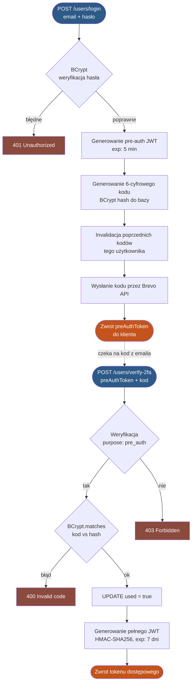

# Dokumentacja Bezpieczeństwa Systemów Informatycznych
## eZielnik API

---

## Streszczenie

eZielnik API to backend napisany w technologii Spring Boot 4.0 / Java 21. Niniejszy dokument opisuje zastosowane mechanizmy ochrony danych, uwierzytelniania, kontroli dostępu oraz zgodności z RODO. Wszystkie warstwy systemu (uwierzytelnianie, autoryzacja, walidacja danych, przechowywanie plików, komunikacja zewnętrzna) zostały zaprojektowane z zastosowaniem zasady obrony w głąb (defense in depth).

---

## 1. Opis systemu

eZielnik API to backendowy serwis REST stanowiący zaplecze trzech aplikacji (desktop, web, mobilna) służących do identyfikacji i katalogowania flory i przeglądaniem zielników innych ludzi. System obsługuje rejestrację i uwierzytelnianie użytkowników, zarządzanie zielnikami i roślinami, identyfikację gatunków przez zewnętrzne API PlantNet, przechowywanie zdjęć oraz funkcje społecznościowe takie jak znajomi i powiadomienia.

Serwis jest wdrożony na platformie Railway z bazą danych PostgreSQL. Cała komunikacja klient-serwer odbywa się wyłącznie przez HTTPS, co gwarantuje poufność i integralność przesyłanych danych.

---

## 2. Uwierzytelnianie użytkowników

### 2.1 JWT jako mechanizm sesji

System stosuje bezstanowe uwierzytelnianie oparte na tokenach JWT (JSON Web Token) podpisanych algorytmem HMAC-SHA256. Po poprawnym zalogowaniu użytkownik otrzymuje token zawierający następujące claimy:

- `sub`: UUID użytkownika (identyfikator wewnętrzny, nie sekwencyjny)
- `username`, `email`: dane pomocnicze
- `iat`, `exp`: czas wydania i wygaśnięcia (domyślnie 7 dni)

Token jest przesyłany w nagłówku `Authorization: Bearer <token>` przy każdym żądaniu do chronionych zasobów. Brak sesji serwerowej eliminuje potrzebę synchronizacji stanu między instancjami oraz wyklucza klasyczne ataki na server-side session ID.

### 2.2 Weryfikacja stanu konta przy każdym żądaniu

Sam token JWT nie jest wystarczający do uzyskania dostępu. Komponent `AccountStatusInterceptor` weryfikuje przy każdym żądaniu aktualny stan konta bezpośrednio w bazie danych:

- czy konto istnieje,
- czy konto jest aktywne (`is_active = true`),
- czy adres email został zweryfikowany (`is_verified = true`).

Dzięki temu zbanowanie użytkownika, odebranie roli administratora lub usunięcie konta działa **natychmiast**, bez czekania na wygaśnięcie tokenu JWT. Jest to świadoma decyzja architektoniczna, która zapewnia silną kontrolę nad cyklem życia sesji użytkowników.

Interceptor rozróżnia również tokeny pre-auth (2FA) od pełnych tokenów dostępowych. Token pre-auth jest przepuszczany wyłącznie do endpointów weryfikacji 2FA, a wszędzie indziej blokowany odpowiedzią `403 Forbidden`.

### 2.3 Hashowanie haseł

Hasła są przechowywane wyłącznie jako skróty BCrypt. BCrypt jest algorytmem odpornym na ataki słownikowe i tęczowe tablice dzięki wbudowanemu saltowaniu. Porównanie hasła odbywa się przez metodę `PasswordEncoder.matches(...)`, nigdy jawnie. Hash hasła nie jest zwracany w żadnej odpowiedzi API.

### 2.4 Wymagania dotyczące siły hasła

System wymaga spełnienia następujących warunków zarówno przy rejestracji, jak i przy resetowaniu hasła:

| Wymaganie | Opis |
|---|---|
| Długość | Minimum 8 znaków |
| Wielka litera | Co najmniej jedna |
| Cyfra | Co najmniej jedna |
| Znak specjalny | Co najmniej jeden |

Walidacja jest wykonywana wyłącznie po stronie serwera, co uniemożliwia jej obejście przez bezpośrednie wywołanie API z pominięciem frontendu.

---

## 3. Dwuskładnikowe uwierzytelnianie (2FA)

System oferuje opcjonalne uwierzytelnianie dwuskładnikowe przez email, oparte na wzorcu **pre-auth token**.

### 3.1 Przebieg procesu 2FA



### 3.2 Zabezpieczenia mechanizmu 2FA

**Ograniczony zasięg tokenu pre-auth.** Token pre-auth zawiera claim `purpose: pre_auth`. Interceptor `AccountStatusInterceptor` blokuje go na wszystkich endpointach z wyjątkiem `/users/verify-2fa` oraz `/users/2fa/send-email-code`. Próba użycia go jako zwykłego tokenu dostępu kończy się odpowiedzią `403 Forbidden`.

**Hashowanie kodów weryfikacyjnych.** Kody 2FA są hashowane algorytmem BCrypt przed zapisem do bazy danych, identycznie jak hasła użytkowników. Nawet potencjalny wyciek tabeli `two_factor_codes` nie ujawnia aktywnych kodów.

**Jednorazowość kodów.** Po poprawnej weryfikacji kod jest oznaczany flagą `used = true`. Ponowne przesłanie tego samego kodu kończy się odrzuceniem, co skutecznie eliminuje wektor ataku typu replay.

**Automatyczna invalidacja.** Wysłanie nowego kodu unieważnia wszystkie poprzednie kody danego użytkownika, eliminując ryzyko akumulacji ważnych kodów.

**Wygaśnięcie i czyszczenie.** Kody wygasają po 10 minutach. Zaplanowany task (`@Scheduled`) usuwa wygasłe rekordy z bazy co godzinę.

---

## 4. Weryfikacja emaila i zarządzanie hasłem

### 4.1 Weryfikacja adresu email

Po rejestracji konto jest tworzone z flagą `is_verified = false`. System wysyła na podany adres email link z tokenem JWT o celu `purpose: email_verification`, ważnym 15 minut.

Użytkownik niezweryfikowany może sprawdzić swój profil (`GET /users/me`), ale nie ma dostępu do żadnych innych chronionych zasobów. Wymuszenie weryfikacji emaila chroni przed użyciem cudzych lub fałszywych adresów.

**Ochrona przed enumeracją kont:** w przypadku ponownego wysłania linku weryfikacyjnego system zwraca identyczny neutralny komunikat niezależnie od tego, czy podany email istnieje w bazie.

### 4.2 Reset hasła

Proces resetu hasła jest realizowany przez jednorazowy token JWT (`purpose: password_reset`, ważność 15 minut) z mechanizmem `passwordVersion`:

- Token zawiera HMAC skrótu aktualnego hasła użytkownika.
- Po zmianie hasła skrót się zmienia, przez co token automatycznie traci ważność.
- Mechanizm nie wymaga osobnej tabeli tokenów w bazie danych. Wyciek bazy nie ujawnia aktywnych tokenów resetujących.

Dodatkowe zabezpieczenia obejmują:

- nowe hasło nie może być identyczne z poprzednim,
- konto nieaktywne nie może zresetować hasła,
- endpoint `forgot-password` zwraca identyczny komunikat dla istniejących i nieistniejących adresów email.

### 4.3 Ochrona formularza HTML resetu hasła

Token przesyłany jako parametr URL w formularzu resetu hasła jest escapowany przez `HtmlUtils.htmlEscape(...)` przed wstawieniem do HTML. Chroni to przed wstrzyknięciem kodu HTML lub JavaScript przez spreparowany parametr `token`.

---

## 5. Kontrola dostępu

### 5.1 Model ról

System rozróżnia dwie role: zwykły użytkownik i administrator. Rola jest przechowywana w bazie danych jako flaga `is_admin`, a nie w tokenie JWT. Frontend nie ma żadnego wpływu na uprawnienia użytkownika.

### 5.2 ID użytkownika zawsze z tokenu JWT

Operacje na własnych zasobach (profil, zielniki, powiadomienia, usunięcie konta) pobierają ID użytkownika wyłącznie z `jwt.getSubject()`. ID nigdy nie jest pobierane z ciała żądania ani z parametrów URL. Eliminuje to możliwość podszywania się pod innego użytkownika przez manipulację danymi wejściowymi.

### 5.3 Zabezpieczenia panelu administracyjnego

Przed każdą operacją administracyjną system weryfikuje, czy wykonujący admin istnieje, jest aktywny oraz posiada `is_admin = true`. Obowiązują dodatkowe reguły bezpieczeństwa:

- administrator nie może zbanować własnego konta,
- administrator nie może odebrać sobie roli admina,
- nadanie roli admina wymaga aktywnego i zweryfikowanego konta docelowego,
- unbanning nie jest możliwy dla kont anonimizowanych (usuniętych).

### 5.4 Prywatność zasobów

Zielniki i ich zawartość mogą być publiczne lub prywatne. Prywatne zasoby są dostępne wyłącznie dla właściciela lub zaprzyjaźnionych użytkowników. Dostęp do zdjęć z prywatnych zielników jest kontrolowany na poziomie warstwy serwisowej, niezależnie od warstwy kontrolera.

---

## 6. Rate Limiting

System posiada globalny filtr ograniczania ruchu (`RateLimitFilter`) oparty o bibliotekę Bucket4j z cache Caffeine, działający jako filtr o najwyższym priorytecie (`Ordered.HIGHEST_PRECEDENCE`).

| Parametr | Wartość domyślna | Konfiguracja |
|---|---|---|
| Pojemność bucket | 30 żądań | `APP_RATE_LIMIT_CAPACITY` |
| Czas odświeżenia | 1 minuta | `APP_RATE_LIMIT_REFILL_MINUTES` |
| Odpowiedź przy przekroczeniu | `429 Too Many Requests` | brak |
| Nagłówek czasu oczekiwania | `Retry-After: <sekundy>` | brak |
| Nagłówek pozostałego limitu | `X-Rate-Limit-Remaining` | brak |

Klucz limitu pochodzi z `request.getRemoteAddr()`, a nie z nagłówka `X-Forwarded-For`, który może być sfałszowany przez klienta. Cache Caffeine przechowuje maksymalnie 10 000 adresów IP z wygasaniem po 100 minutach braku aktywności, co zapobiega nieograniczonemu wzrostowi pamięci.

Filtr działa z priorytetem `HIGHEST_PRECEDENCE`, czyli przed Spring Security. Oznacza to, że nawet nieuwierzytelnione żądania są rate-limitowane, co chroni między innymi endpointy rejestracji i resetowania hasła bez konieczności posiadania tokenu JWT.

Rate limiting chroni przed atakami brute force na endpoint logowania, spamem rejestracji, nadużywaniem endpointów wysyłających emaile oraz prostymi atakami typu DoS.

---

## 7. Bezpieczeństwo przechowywania zdjęć

### 7.1 UUID jako nazwa pliku

Każde zapisane zdjęcie otrzymuje losową nazwę UUID w formacie `uuid.jpeg`. Uniemożliwia to przewidywanie URL innych zdjęć i sekwencyjne pobieranie zasobów.

### 7.2 Konwersja do JPEG i usuwanie metadanych

Wszystkie przesyłane obrazy są konwertowane do formatu JPEG przed zapisem. Mechanizm ten zapewnia:

- **Odrzucenie plików nie-obrazkowych:** wartość `content-type` musi zaczynać się od `image/`. Inne typy zwracają `400 Bad Request` bez dotykania systemu plików.
- **Usunięcie metadanych EXIF:** ponowne kodowanie przez Java ImageIO usuwa dane EXIF takie jak lokalizacja GPS, model urządzenia czy dane osobowe osadzone przez aplikacje.
- **Normalizację formatu:** obsługiwane są JPEG, PNG, BMP, GIF oraz WebP (przez bibliotekę TwelveMonkeys).
- **Spłaszczenie kanału alfa:** transparentność PNG/WebP jest zastępowana białym tłem, ponieważ JPEG nie obsługuje przezroczystości.

### 7.3 Ochrona przed path traversal

Przy serwowaniu zdjęć nazwa pliku jest normalizowana metodą `Path.normalize()` i sprawdzana, czy wynikowa ścieżka nadal mieści się w katalogu `storageRoot` przez wywołanie `filePath.startsWith(storageRoot)`. Zapobiega to dostępowi do plików systemu spoza katalogu zdjęć przez spreparowaną nazwę zawierającą np. `../../etc/passwd`.

---

## 8. Ochrona przed typowymi atakami

Poniższa tabela podsumowuje obronę systemu przed klasycznymi wektorami ataku znanymi z OWASP Top 10 i innych klasyfikacji zagrożeń.

| Atak | Zastosowane zabezpieczenie |
|---|---|
| Brute force logowania | Rate limiting per IP, BCrypt (celowo wolny) |
| Enumeracja kont | Neutralne komunikaty na forgot-password i resend-verification |
| Enumeracja login/hasło | Jeden komunikat dla błędnego loginu i błędnego hasła |
| Replay attack (2FA) | Flaga `used`, jednorazowe kody |
| Token confusion | Claim `purpose` w tokenach weryfikacyjnych i pre-auth |
| Path traversal | Normalizacja i walidacja ścieżki pliku |
| HTML injection | `HtmlUtils.htmlEscape` w formularzu resetu hasła |
| Ujawnienie stack trace | `GlobalExceptionHandler` zwraca tylko krótki komunikat, `SPRING_WEB_ERROR_INCLUDE_STACKTRACE=never` |
| Wyciek uprawnień przez JWT | Uprawnienia weryfikowane z bazy przy każdym żądaniu |
| CSRF | Nie dotyczy, ponieważ API jest bezstanowe, a uwierzytelnianie odbywa się wyłącznie przez nagłówek `Authorization: Bearer`, nie przez cookie |
| Przewidywalne URL zasobów | UUID jako nazwy plików zdjęć i identyfikatory encji |
| Dostęp do cudzych powiadomień | Ownership check przed oznaczeniem powiadomienia jako przeczytane |
| SQL injection | Parametryzowane zapytania JPA/Hibernate, brak ręcznej konkatenacji SQL |
| Wyciek sekretów do repozytorium | Wszystkie sekrety w zmiennych środowiskowych, brak hardcoded credentials |

---

## 9. Konfiguracja i sekrety

Wszystkie wrażliwe wartości konfiguracyjne są przekazywane przez zmienne środowiskowe. Żadna z nich nie jest zakodowana na stałe w kodzie źródłowym:

| Zmienna | Przeznaczenie |
|---|---|
| `JWT_SECRET` | Sekret podpisywania tokenów JWT |
| `DB_PASSWORD` | Hasło bazy danych PostgreSQL |
| `BREVO_API_KEY` | Klucz API do wysyłania emaili (HTTP API, nie SMTP) |
| `PLANTNET_API_KEY` | Klucz API do identyfikacji roślin |

Wysyłanie emaili odbywa się przez HTTP API serwisu Brevo. Sekret nie opuszcza backendu, a frontend nie zna żadnych danych uwierzytelniających do zewnętrznych serwisów. Komunikacja z usługami zewnętrznymi odbywa się wyłącznie przez HTTPS.

---

## 10. Logowanie zdarzeń

Logowanie zdarzeń aplikacji jest realizowane w całości na poziomie platformy hostingowej Railway, na której wdrożony jest serwis. Railway integruje się natywnie z uruchomioną aplikacją i bez dodatkowej konfiguracji po stronie kodu udostępnia logi w kilku rozłącznych kategoriach:

- **Build Logs**: pełna historia procesu budowania kontenera, obejmująca kompilację, instalację zależności i ewentualne błędy build-time.
- **Deploy Logs**: logi wdrożeń i restartów instancji, kluczowe dla audytu zmian środowiskowych i diagnostyki nieudanych deploymentów.
- **HTTP Logs**: rejestracja wszystkich żądań HTTP trafiających do API wraz z kodami odpowiedzi, ścieżkami, adresami źródłowymi i czasami przetwarzania.
- **Network Flow Logs**: ruch sieciowy na poziomie infrastruktury, użyteczny przy analizie anomalii i podejrzanej aktywności.

Dzięki temu zdarzenia istotne z punktu widzenia bezpieczeństwa, takie jak nieudane próby logowania, masowe żądania do endpointów uwierzytelniania, próby dostępu do nieistniejących zasobów (404) czy odrzucenia z `429 Too Many Requests`, są w pełni widoczne w logach HTTP wraz z adresami źródłowymi i znacznikami czasu. Logi są dostępne w czasie rzeczywistym z poziomu panelu Railway, a ich przechowywanie i rotacja są zarządzane przez platformę.

---

## 11. Cykl życia konta i zgodność z RODO

### 11.1 Soft delete z anonimizacją

Usunięcie konta przez użytkownika nie powoduje fizycznego usunięcia rekordu z bazy danych. Zamiast tego konto jest anonimizowane według następującego schematu:

```
is_active      →  false
is_verified    →  false
email          →  deleted-<uuid>@deleted.local
username       →  deleted-user-<uuid>
password_hash  →  losowy hash BCrypt
```

Podejście to zachowuje integralność relacji w bazie danych (klucze obce), uniemożliwia logowanie na usunięte konto, zwalnia oryginalny email i username do ponownego użycia oraz realizuje prawo do bycia zapomnianym (RODO art. 17).

### 11.2 Normalizacja danych wejściowych

Przed zapisem do bazy email jest trimowany i konwertowany do lowercase przez wywołanie `email.trim().toLowerCase()`, a username trimowany. Zapobiega to rejestracji wielu kont z pozornie różnymi, ale logicznie identycznymi adresami (np. `Test@Email.com` vs `test@email.com`) oraz problemom z przypadkowymi spacjami w nazwie użytkownika.

### 11.3 Minimalizacja danych

System przechowuje wyłącznie dane niezbędne do działania aplikacji: email, username, hash hasła, statusy konta oraz znaczniki czasu. Pola `createdAt` i `updatedAt` umożliwiają audyt bez przechowywania dodatkowych danych osobowych. Realizuje to zasadę minimalizacji danych wynikającą z RODO art. 5 ust. 1 lit. c.

---

## 12. Podsumowanie postawy bezpieczeństwa

eZielnik API został zaprojektowany zgodnie z zasadą obrony w głąb, gdzie każda warstwa systemu posiada własne, niezależne mechanizmy ochronne. Najważniejsze cechy bezpieczeństwa systemu to:

1. **Silne uwierzytelnianie**: JWT z weryfikacją stanu konta przy każdym żądaniu, opcjonalne 2FA z hashowanymi kodami jednorazowymi, BCrypt dla haseł.
2. **Ścisła kontrola dostępu**: ID użytkownika zawsze z tokenu, autoryzacja na poziomie warstwy serwisowej, oddzielne reguły dla operacji administracyjnych.
3. **Ochrona przed atakami warstwy aplikacyjnej**: rate limiting przed Spring Security, escapowanie HTML, walidacja ścieżek plików, parametryzowane zapytania.
4. **Bezpieczne przechowywanie danych**: hashowanie haseł i kodów 2FA, usuwanie metadanych EXIF ze zdjęć, UUID zamiast identyfikatorów sekwencyjnych.
5. **Zgodność z RODO**: anonimizacja zamiast usunięcia, minimalizacja danych, neutralne komunikaty zapobiegające enumeracji.
6. **Higiena konfiguracji**: wszystkie sekrety w zmiennych środowiskowych, komunikacja przez HTTPS, brak hardcoded credentials.

Zastosowane mechanizmy odpowiadają na kluczowe kategorie z OWASP Top 10 istotne dla zakresu funkcjonalnego API. System został zaprojektowany tak, aby pojedynczy błąd lub kompromitacja jednego komponentu nie prowadziły do pełnego naruszenia bezpieczeństwa danych użytkowników.
