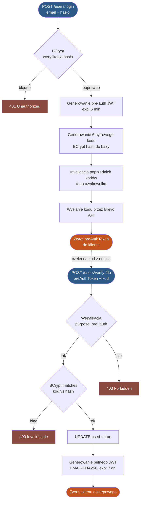

# Sprawozdanie Projektowe
## Bezpieczeństwo Systemów Informatycznych
### eZielnik: System identyfikacji flory / REST API

---

| **Projekt**     | eZielnik API                            |
| --------------- | --------------------------------------- |
| **Technologia** | Spring Boot 4.0 / Java 21 / PostgreSQL  |
| **Wdrożenie**   | Railway (cloud PaaS)                    |
| **Przedmiot**   | Bezpieczeństwo Systemów Informatycznych |

---

## Streszczenie

Sprawozdanie opisuje proces projektowania i wdrożenia mechanizmów bezpieczeństwa w backendowym serwisie REST eZielnik API. System został zrealizowany jako produkcyjnie działająca aplikacja udostępniona publicznie przez HTTPS, co wymagało zastosowania pełnowartościowych mechanizmów ochrony: bezstanowego uwierzytelniania JWT z opcjonalną weryfikacją dwuskładnikową, kontroli dostępu opartej o role i ownership, ochrony przed klasycznymi atakami warstwy aplikacyjnej (OWASP Top 10) oraz zgodności z RODO. Dokument przedstawia również pięć rzeczywistych problemów bezpieczeństwa napotkanych w trakcie implementacji wraz z analizą ich źródeł i sposobu rozwiązania, ilustrując praktyczny wymiar inżynierii bezpieczeństwa systemów rozproszonych.

---

## 1. Cel i zakres projektu

Celem projektu było zaprojektowanie i wdrożenie backendowego serwisu REST służącego jako zaplecze trzech aplikacji (desktop, web, mobilna) służących do identyfikacji i katalogowania flory i przeglądaniem zielników innych ludzi. Projekt zrealizowano jako produkcyjnie działający system dostępny publicznie przez HTTPS, co oznaczało konieczność zastosowania rzeczywistych, a nie tylko demonstracyjnych mechanizmów bezpieczeństwa.

Zakres systemu obejmuje:

- rejestrację i uwierzytelnianie użytkowników z opcjonalną weryfikacją dwuskładnikową (2FA),
- zarządzanie zielnikami i roślinami z kontrolą dostępu (publiczne / prywatne zasoby),
- integrację z zewnętrznym API PlantNet do identyfikacji gatunków,
- przesyłanie i serwowanie zdjęć roślin z przetwarzaniem po stronie serwera,
- funkcje społecznościowe (znajomi, powiadomienia, system ostrzeżeń),
- panel administracyjny z zarządzaniem użytkownikami.

Niniejsze sprawozdanie opisuje decyzje projektowe dotyczące bezpieczeństwa, zidentyfikowane zagrożenia, zastosowane środki zaradcze oraz rzeczywiste problemy bezpieczeństwa napotkane w trakcie realizacji i ich rozwiązania.

---

## 2. Architektura systemu a bezpieczeństwo

### 2.1 Stos technologiczny

| Warstwa | Technologia | Uzasadnienie bezpieczeństwa |
|---|---|---|
| Framework | Spring Boot 4.0 / Java 21 | Dojrzały ekosystem, aktywne patches bezpieczeństwa |
| Uwierzytelnianie | Spring Security + OAuth2 Resource Server | Standaryzowana obsługa JWT, minimalizacja własnego kodu auth |
| Hashowanie | BCrypt (Spring Security Crypto) | Odporność na ataki słownikowe i tęczowe tablice |
| Baza danych | PostgreSQL + Hibernate/JPA | Parametryzowane zapytania, brak ręcznego SQL |
| Rate limiting | Bucket4j + Caffeine | Ochrona przed brute force i DoS |
| Email | Brevo HTTP API | Brak przechowywania credentials SMTP na serwerze |
| Wdrożenie | Railway + HTTPS | Szyfrowanie transportu bez konfiguracji własnego TLS |

### 2.2 Model bezpieczeństwa warstwowego

System realizuje zasadę **obrony w głąb**: każda warstwa posiada własne, niezależne mechanizmy ochronne.

```
Klient
  ↓ HTTPS
[Rate Limit Filter]         ← blokuje nadmierny ruch przed Spring Security
  ↓
[Spring Security / JWT]     ← weryfikacja podpisu i ważności tokenu
  ↓
[AccountStatusInterceptor]  ← weryfikacja aktualnego stanu konta w bazie
  ↓
[Kontroler]                 ← walidacja danych wejściowych, weryfikacja uprawnień
  ↓
[Serwis]                    ← reguły biznesowe bezpieczeństwa, ownership checks
  ↓
[Baza danych]               ← integralność referencyjna, unikalne ograniczenia
```

Dzięki takiej strukturze kompromitacja jednej warstwy nie prowadzi automatycznie do naruszenia całego systemu.

---

## 3. Analiza zagrożeń

Przed implementacją zidentyfikowano kluczowe wektory ataku dla systemu tego rodzaju:

| Zagrożenie | Kategoria OWASP | Ocena ryzyka | Zastosowane zabezpieczenie |
|---|---|---|---|
| Brute force logowania | A07 - Auth Failures | Wysokie | Rate limiting per IP, BCrypt |
| Przejęcie konta przez reset hasła | A07 | Wysokie | Token jednorazowy z passwordVersion |
| Enumeracja kont przez emaile | A01 - Broken Access Control | Średnie | Neutralne komunikaty |
| Podszywanie się pod użytkownika | A01 | Wysokie | ID wyłącznie z JWT, nigdy z body |
| Nieautoryzowany dostęp do prywatnych zasobów | A01 | Wysokie | Ownership checks w warstwie serwisowej |
| Wyciek danych po wycieku bazy | A02 - Cryptographic Failures | Wysokie | BCrypt, brak plaintext secrets |
| SQL injection | A03 - Injection | Wysokie | Parametryzowane zapytania JPA |
| HTML/JS injection | A03 | Niskie | HtmlUtils.htmlEscape w formularzu |
| Path traversal przy zdjęciach | A01 | Średnie | Normalizacja i walidacja ścieżki |
| Nieautoryzowane akcje admina | A01 | Wysokie | Weryfikacja roli z bazy przy każdym żądaniu |
| Replay attack na 2FA | A07 | Średnie | Flaga used, jednorazowe kody |
| Ujawnienie stack trace | A05 - Misconfig | Niskie | GlobalExceptionHandler, stacktrace=never |

---

## 4. Zaimplementowane mechanizmy bezpieczeństwa

### 4.1 Uwierzytelnianie: JWT z kontrolą stanu konta

System stosuje bezstanowe JWT (HMAC-SHA256, domyślny czas życia 7 dni). Kluczową decyzją projektową było **nieopieranie się wyłącznie na tokenie**: komponent `AccountStatusInterceptor` weryfikuje przy każdym żądaniu aktualny stan konta w bazie.

- aktywność konta (`is_active`)
- weryfikację emaila (`is_verified`)
- typ tokenu (pełny vs. pre-auth)

Oznacza to, że zbanowanie użytkownika lub odebranie roli admina działa natychmiast, bez czekania na wygaśnięcie tokenu. Rozwiązuje to znany problem JWT (brak możliwości natychmiastowego unieważnienia tokenu) bez konieczności wdrożenia kosztownej blacklisty po stronie serwera.

### 4.2 Dwuskładnikowe uwierzytelnianie (2FA email)

Zaimplementowany mechanizm 2FA oparty jest na wzorcu **pre-auth token**, który rozdziela fazę weryfikacji hasła od fazy weryfikacji kodu:

1. Po poprawnym haśle system zwraca krótkotrwały token pre-auth (5 minut) z claimem `purpose: pre_auth`
2. Token ten jest akceptowany **wyłącznie** na dwóch endpointach: `/users/verify-2fa` i `/users/2fa/send-email-code`
3. 6-cyfrowy kod wysyłany emailem jest hashowany BCryptem przed zapisem do bazy
4. Kod jest jednorazowy (`used = true` po weryfikacji), co stanowi ochronę przed replay attack
5. Wysłanie nowego kodu unieważnia poprzednie

Pełny przepływ procesu 2FA przedstawia poniższy diagram:



Mechanizm zapewnia, że nawet przechwycenie tokenu pre-auth nie daje pełnego dostępu do systemu.

### 4.3 Bezpieczeństwo przechowywania zdjęć

Wszystkie przesyłane obrazy są konwertowane do formatu JPEG przed zapisem. Zabieg ten eliminuje kilka zagrożeń jednocześnie: usuwa metadane EXIF (lokalizacja GPS, model urządzenia), normalizuje format (odrzuca pliki niebędące obrazami zwracając 400) oraz zapewnia spójność przechowywanych plików. Pliki są zapisywane pod losowymi nazwami UUID, co uniemożliwia sekwencyjne pobieranie zasobów. Przy serwowaniu pliku ścieżka jest normalizowana i sprawdzana względem katalogu głównego, eliminując ataki path traversal.

### 4.4 Zarządzanie sekretami

Żaden sekret ani dane konfiguracyjne nie są zakodowane na stałe w kodzie źródłowym. Wszystkie wrażliwe wartości (`JWT_SECRET`, `DB_PASSWORD`, `BREVO_API_KEY`, `PLANTNET_API_KEY`) są przekazywane przez zmienne środowiskowe platformy Railway. Plik `.env.properties` używany lokalnie jest wykluczony z repozytorium przez `.gitignore` i `.dockerignore`.

---

## 5. Problemy bezpieczeństwa napotkane w trakcie realizacji

Ta sekcja opisuje rzeczywiste błędy bezpieczeństwa popełnione podczas implementacji, zidentyfikowane w trakcie testowania oraz ich rozwiązania. Stanowi kluczową część sprawozdania, ponieważ ilustruje praktyczny aspekt pracy z zabezpieczeniami systemów.

### Problem 1: Niezamierzone usuwanie tokenów JWT z żądań

**Opis:** W celu uniknięcia błędów 401 na publicznych endpointach (Spring Security odrzuca nieważne tokeny przed sprawdzeniem `permitAll()`), wdrożono `BearerTokenResolver` pomijający ekstrakcję tokenu dla wybranych ścieżek. Problem polegał na zbyt szerokim stosowaniu metody `startsWith()` przy dopasowywaniu ścieżek. Przykładowo, reguła `path.startsWith("/users/verify")` dopasowywała zarówno `/users/verify` (publiczny endpoint weryfikacji emaila) jak i `/users/verify-2fa` (endpoint wymagający pre-auth tokenu). Token był usuwany przed dotarciem do kontrolera, co powodowało odpowiedź 401 zamiast prawidłowego przetworzenia żądania.

Ten sam błąd w różnych wariantach wystąpił trzykrotnie: dla ścieżek `/herbaria/*/plants`, `/photos/` oraz `/users/verify-2fa`.

**Rozwiązanie:** Zastąpienie `startsWith()` metodą `equals()` dla wszystkich ścieżek jednoznacznych. Tylko dwie ścieżki legitymują użycie `startsWith()`: `/v3/api-docs` i `/swagger-ui`, które obsługują zagnieżdżone zasoby statyczne.

**Wniosek:** Niedokładne dopasowywanie ścieżek w filtrach bezpieczeństwa jest klasycznym źródłem podatności. Każda ścieżka dodawana do listy pominięć musi być weryfikowana pod kątem tego, czy nie blokuje uwierzytelniania na innych, zależnych endpointach.

---

### Problem 2: Zdjęcia tracone przy każdym wdrożeniu

**Opis:** Zdjęcia były przechowywane pod ścieżką `./photos`, co na platformie Railway oznaczało katalog wewnątrz kontenera. Kontener jest zastępowany nowym obrazem przy każdym wdrożeniu, więc zawartość efemerycznego systemu plików jest tracona. Rekordy w bazie danych (PostgreSQL, osobny serwis) przeżywały wdrożenie, ale same pliki nie. Skutkiem były trwałe błędy 404 dla wszystkich wcześniej przesłanych zdjęć.

**Rozwiązanie:** Zmiana zmiennej `PHOTO_STORAGE_PATH` na `/data/photos` i podłączenie wolumenu trwałego Railway pod tę ścieżkę. Wolumen przeżywa wdrożenia i restarty kontenera.

**Wniosek:** Architektura bezstanowych kontenerów wymaga świadomego oddzielenia stanu ulotnego (kontener) od trwałego (baza danych, wolumen). Brak tej świadomości prowadzi do utraty danych użytkowników.

---

### Problem 3: Nieprawidłowe działanie 2FA spowodowane brakiem tokenu

**Opis:** Przy pierwszym testowaniu flow 2FA użytkownik wysyłał żądanie do `/users/verify-2fa` bez nagłówka `Authorization`. Odpowiedź 401 była mylona z błędem weryfikacji kodu, co maskowało rzeczywisty problem (brak tokenu) i prowadziło do wielokrotnych nieudanych prób z nowym kodem.

**Rozwiązanie:** Dodanie szczegółowego opisu w adnotacji Swagger dla endpointu `verify-2fa`, wskazującego wprost, że wymagany jest pre-auth token z odpowiedzi `/login`, a nie zwykły token dostępowy. Uzupełniono też dokumentację o pełne kody odpowiedzi (401: brak tokenu, 403: token nie jest pre-auth, 400: błędny kod).

**Wniosek:** Niestandardowy flow uwierzytelniania (pre-auth token) wymaga jednoznacznej dokumentacji API. Brak opisu wymaganego typu tokenu jest realną barierą integracyjną.

---

### Problem 4: Brak kolumny w bazie przy wdrożeniu nowej encji

**Opis:** Pole `email_two_factor_enabled` zostało dodane do encji `User` z adnotacją `@Column(nullable = false)`. Hibernate przy trybie `ddl-auto=update` próbował dodać kolumnę do istniejącej tabeli zawierającej rekordy, ale bez klauzuli `DEFAULT`. PostgreSQL odrzucił operację: *"column contains null values"*. Aplikacja startowała, ale każde zapytanie do tabeli `users` kończyło się błędem 500.

**Rozwiązanie:** Dodanie atrybutu `columnDefinition = "boolean not null default false"` do adnotacji `@Column`, co wymusiło na Hibernate wygenerowanie poprawnej klauzuli DDL z wartością domyślną.

**Wniosek:** `ddl-auto=update` nie jest bezpieczny dla produkcyjnych baz z danymi. Przy produkcyjnych wdrożeniach bezpieczniejszym rozwiązaniem są migracje przez Flyway lub Liquibase, które dają pełną kontrolę nad zmianami schematu.

---

### Problem 5: Blokada SMTP na platformie wdrożeniowej

**Opis:** Railway blokuje wychodzący ruch SMTP (porty 25, 587, 465) na planach bezpłatnych i hobby. System wysyłania emaili oparty na JavaMailSender przestał działać całkowicie po wdrożeniu, mimo że działał lokalnie. Próba na obu standardowych portach (587 i 465) zakończyła się błędami sieciowymi (`INVALID_PROTO`, `ICMP_CSUM`).

**Rozwiązanie:** Całkowite zastąpienie JavaMailSender wywołaniami HTTP API serwisu Brevo (`RestClient` -> `POST /smtp/email`). Podejście HTTP API jest niezależne od portów SMTP i działa na każdej platformie obsługującej wychodzący HTTPS.

**Wniosek:** Zależność od protokołu SMTP w środowiskach PaaS/cloud jest ryzykiem architektonicznym. HTTP API do wysyłki emaili jest bezpieczniejszym wyborem dla wdrożeń cloudowych: brak problemu z portami, lepsza obserwowalność (logi API), łatwiejsza konfiguracja zabezpieczeń.

---

## 6. Bezpieczeństwo infrastruktury wdrożeniowej

### HTTPS

Cały ruch klient-serwer odbywa się przez HTTPS zarządzany przez Railway. Certyfikat TLS jest automatycznie odnawiany, co eliminuje ryzyko wygaśnięcia.

### Izolacja bazy danych

Baza PostgreSQL działa jako osobny serwis Railway z siecią wewnętrzną. Połączenie z aplikacją odbywa się przez prywatny URL niedostępny z zewnątrz. Publiczny URL bazy (używany wyłącznie do administracji) jest chroniony hasłem.

### Sekrety w środowisku

Platforma Railway przechowuje zmienne środowiskowe zaszyfrowane i wstrzykuje je do kontenera w czasie uruchomienia. Nie są widoczne w logach ani w historii deploymentów.

### Trwałość danych

Zdjęcia są przechowywane na wolumenie trwałym Railway (`/data/photos`), który przeżywa wdrożenia i restarty kontenera. Baza danych jest zarządzana przez Railway z automatycznymi backupami.

### Logowanie zdarzeń

Logowanie zdarzeń aplikacji jest realizowane w całości na poziomie platformy Railway, bez konieczności konfiguracji dodatkowej infrastruktury logowania po stronie aplikacji. Platforma udostępnia logi w czterech rozłącznych kategoriach:

- **Build Logs**: pełna historia procesu budowania kontenera, kompilacji i instalacji zależności.
- **Deploy Logs**: rejestracja wdrożeń i restartów instancji, kluczowa dla audytu zmian środowiskowych.
- **HTTP Logs**: wszystkie żądania HTTP wraz z kodami odpowiedzi, ścieżkami, adresami źródłowymi i czasami przetwarzania.
- **Network Flow Logs**: ruch sieciowy na poziomie infrastruktury, użyteczny przy analizie anomalii.

Dzięki temu zdarzenia istotne z punktu widzenia bezpieczeństwa, takie jak nieudane próby logowania, masowe żądania do endpointów uwierzytelniania, odrzucenia z kodem `429 Too Many Requests` czy próby dostępu do nieistniejących zasobów, są widoczne w logach HTTP wraz z adresami źródłowymi i znacznikami czasu. Logi są dostępne w czasie rzeczywistym z poziomu panelu Railway, a ich przechowywanie i rotacja są zarządzane przez platformę.

---
## 7. Znane ograniczenia i świadome kompromisy  
  
| Ograniczenie                    | Implikacja                                      | Uzasadnienie                                                                                                  |
| ------------------------------- | ----------------------------------------------- | ------------------------------------------------------------------------------------------------------------- |
| Brak server-side blacklisty JWT | Unieważnienie tokenu wymaga zmiany `JWT_SECRET` | Częściowo kompensowane przez sprawdzanie stanu konta z bazy przy każdym żądaniu                               |
| Brak refresh tokenów            | Token 7-dniowy; ważny do wygaśnięcia            | Uproszczenie, wprowadzenie refresh tokenów zwiększyłoby skomplikowanie całego procesu i wymagałoby dużo pracy |
| Rate limiting in-memory         | Przy wielu instancjach brak wspólnego licznika  | Jedna instancja w obecnym wdrożeniu, akceptowalne                                                             |
| Tylko 2FA przez email           | Brak TOTP (Google Authenticator)                | Architektura pozwala na rozszerzenie bez zmian istniejącego kodu, jest to w planach                           |
## 8. Wnioski

Projekt wykazał, że wdrożenie bezpieczeństwa w rzeczywistym systemie produkcyjnym różni się istotnie od implementacji w środowisku laboratoryjnym. Najważniejsze obserwacje:

**Bezpieczeństwo jest procesem, nie stanem.** Trzy błędy związane z tym samym mechanizmem (`BearerTokenResolver`) pokazały, że każda zmiana w logice autoryzacji wymaga systematycznego audytu wszystkich dotkniętych ścieżek, a nie tylko weryfikacji punktu zmiany.

**Środowisko produkcyjne ujawnia założenia.** Blokada SMTP przez Railway, efemeryczność systemu plików kontenerów i ograniczenia DDL na wypełnionej bazie to problemy, które nie istnieją w środowisku deweloperskim. Projektowanie pod kątem środowiska produkcyjnego od początku zmniejsza ryzyko takich niespodzianek.

**Dokumentacja API jako element bezpieczeństwa.** Niestandardowy flow 2FA (pre-auth token) powodował błędy integracyjne wyłącznie z powodu braku opisu w dokumentacji Swagger. Precyzyjny opis wymagań tokenu i kodów błędów jest realnym zabezpieczeniem przed błędną implementacją po stronie klienta.

**Obrona w głąb działa.** Wielowarstwowa architektura bezpieczeństwa (rate limiter → Spring Security → interceptor → warstwa serwisowa) zapewniła, że żaden z napotkanych błędów nie prowadził do pełnego naruszenia bezpieczeństwa systemu; zawsze istniała co najmniej jedna działająca warstwa ochronna.

System w obecnej formie spełnia wymagania bezpieczeństwa odpowiednie dla projektu semestralnego i stanowi spójną realizację zasad bezpiecznego projektowania systemów REST, z architekturą gotową na dalszy rozwój w kierunku w pełni produkcyjnego wdrożenia.
